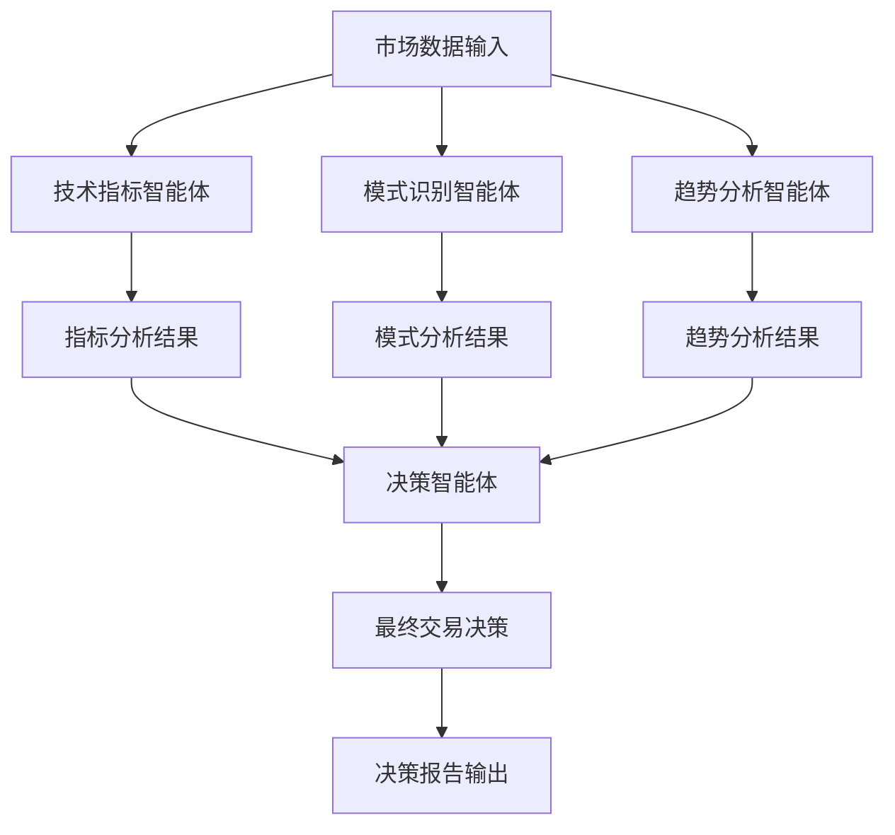

[根目录](../../CLAUDE.md) > **agents**

# Agents 模块 - AI智能体层

## 📋 模块职责

Agents 模块是 QuantAgent 系统的AI智能体层，实现了基于 LangChain 的多智能体协作架构，负责技术指标分析、模式识别、趋势分析和最终交易决策的智能化处理。

**🔒 最新优化**: 已修复文件冲突问题，每个智能体现在都使用独立的数据和图表文件，确保分析结果的准确性。

## 🏗️ 模块结构

```
agents/
├── indicator_agent.py    # 技术指标分析智能体
├── pattern_agent.py      # 模式识别智能体
├── trend_agent.py        # 趋势分析智能体
├── decision_agent.py     # 决策智能体
├── agent_state.py        # 智能体状态管理
```

## 🤖 智能体架构

### 1. 技术指标分析智能体 (`indicator_agent.py`)

**主要功能:**
- MACD (移动平均收敛散度) 计算
- RSI (相对强弱指数) 计算
- ROC (变动率指标) 计算
- Stochastic (随机指标) 计算
- Williams %R 计算

**技术特性:**
- 使用 LangChain 工具调用机制
- 支持多时间框架分析
- 智能参数选择
- 性能监控和进度跟踪

**核心方法:**
```python
def create_indicator_agent(llm, toolkit):
    """创建技术指标分析智能体节点"""

def indicator_agent_node(state):
    """智能体节点执行函数"""
```

### 2. 模式识别智能体 (`pattern_agent.py`)

**主要功能:**
- K线图表生成
- 价格模式识别
- 图表形态分析
- 视觉化技术分析

**技术特性:**
- 🆕 **独立图表生成**: 每次分析使用唯一的图表文件
- 多种图表类型支持
- 模式匹配算法
- 视觉分析结果输出
- **修复状态**: ✅ 已解决固定输出问题

**🎯 重要修复 (2025-10-29):**
- **问题**: 所有币种都显示相同的"下降三角形"分析
- **根因**: 硬编码文件名导致数据污染
- **解决**: 使用智能文件管理系统，每个分析独立处理
- **效果**: 现在每个币种都有真实的、独特的模式识别结果

### 3. 趋势分析智能体 (`trend_agent.py`)

**主要功能:**
- 趋势图表生成
- 趋势方向识别
- 支撑阻力位分析
- 趋势强度评估

**技术特性:**
- 🆕 **独立趋势图生成**: 每次分析使用唯一的趋势图表文件
- 多时间框架趋势分析
- 趋势线自动绘制
- 动态支撑阻力计算
- 趋势持续性预测
- **修复状态**: ✅ 已优化文件管理

**🔧 同步修复:**
- 与模式识别智能体使用相同的智能文件管理系统
- 确保趋势分析也基于独立的图表数据
- 避免与其它分析的数据冲突

### 4. 决策智能体 (`decision_agent.py`)

**主要功能:**
- 多智能体结果融合
- 交易决策生成
- 风险评估
- 置信度计算

**技术特性:**
- 加权决策算法
- 风险管理模型
- 动态置信度调整
- 决策解释生成

### 5. 双模型决策智能体 (`decision_dual_agent.py`) 🆕

**核心功能:**
- 并行执行两个AI模型分析
- 智能对比分析结果
- 2秒延迟启动避免API限速
- 支持任意模型组合对比

**技术特性:**
- **并行执行**: ThreadPoolExecutor实现真正的并行分析
- **智能解析**: 支持多种置信度格式和JSON解析
- **容错机制**: 完善的错误处理和降级方案
- **状态验证**: 完整的数据完整性验证

**数据模型:**
```python
@dataclass
class ModelResult:
    model_id: str
    model_name: str
    decision: str
    confidence: float
    reasoning: str
    risk_reward: str
    stop_loss: Optional[float]
    take_profit: Optional[float]
    market_environment: Optional[str]
    volatility_assessment: Optional[str]
```

### 6. 决策智能体工厂 (`decision_agent_factory.py`)

**主要功能:**
- 统一的智能体创建接口
- 支持单模型和双模型创建
- 配置驱动的智能体初始化

### 7. 决策配置管理 (`decision_configs.py`)

**主要功能:**
- 决策智能体配置参数管理
- 版本化配置支持
- 动态配置更新

### 8. 智能体状态管理 (`agent_state.py`)

**主要功能:**
- 智能体执行状态跟踪
- 中间结果缓存
- 错误状态管理
- 进度信息维护

## 🔧 工具集成

### 技术指标工具集
每个智能体都集成了相应的技术工具：

```python
# 技术指标智能体工具
tools = [
    toolkit.compute_macd,    # MACD计算
    toolkit.compute_rsi,     # RSI计算
    toolkit.compute_roc,     # ROC计算
    toolkit.compute_stoch,   # Stochastic计算
    toolkit.compute_willr,   # Williams %R计算
]
```

### 图表生成工具
```python
# 模式识别智能体工具
tools = [
    toolkit.generate_kline_image,  # K线图生成
]

# 趋势分析智能体工具
tools = [
    toolkit.generate_trend_image,  # 趋势图生成
]
```

## 📊 智能体协作流程

### 分析流程图


### 执行顺序
1. **并行分析阶段**: 技术指标、模式识别、趋势分析智能体同时执行
2. **结果融合阶段**: 决策智能体收集各智能体分析结果
3. **决策生成阶段**: 基于融合结果生成最终交易决策
4. **结果输出阶段**: 格式化输出分析报告和决策建议

## 🎯 提示词工程

### 系统提示词示例
```python
prompt = ChatPromptTemplate.from_messages([
    ("system",
     "你是一名专业的高频交易分析师助手，在时间敏感的环境下操作。"
     "你必须分析技术指标以支持快节奏的交易执行。\n\n"
     "你可以使用以下工具：compute_rsi、compute_macd、compute_roc、compute_stoch 和 compute_willr。"
     "通过提供适当的参数来使用它们，如 `kline_data` 和相应的周期。\n\n"
     f"⚠️ 提供的OHLC数据来自{time_frame}时间框架，反映近期市场行为。"
     "你必须快速准确地解读这些数据。\n\n"
     "这是OHLC数据：\n{kline_data}。\n\n"
     "调用必要的工具并分析结果。\n"
    ),
    MessagesPlaceholder(variable_name="messages"),
])
```

## 📈 性能监控

### 进度跟踪系统
```python
def update_agent_progress(agent_name, progress_within_agent=0, status=""):
    """智能体进度更新函数"""
    stage_progress_map = {
        "indicator": (20, 40, "indicator_analysis"),      # 20-40%
        "pattern": (40, 60, "pattern_analysis"),         # 40-60%
        "trend": (60, 80, "trend_analysis"),            # 60-80%
        "decision": (80, 95, "decision_making")          # 80-95%
    }
```

### 性能装饰器
```python
@performance_monitor("技术指标智能体")
def create_indicator_agent(llm, toolkit):
    """带性能监控的智能体创建函数"""

@performance_monitor("技术指标智能体执行")
def indicator_agent_node(state):
    """带性能监控的智能体执行函数"""
```

## 🔗 LLM集成

### 模型配置
- **Agent模型**: deepseek-ai/DeepSeek-V3.2-Exp
- **温度参数**: 0.1 (确保分析结果的一致性)
- **API服务**: ModelScope (https://api-inference.modelscope.cn/v1)

### 工具绑定机制
```python
chain = prompt | llm.bind_tools(tools)
```

### 工具调用处理
```python
if hasattr(ai_response, "tool_calls"):
    for call in ai_response.tool_calls:
        tool_name = call["name"]
        tool_args = call["args"]
        tool_args["kline_data"] = copy.deepcopy(state["kline_data"])
        tool_fn = next(t for t in tools if t.name == tool_name)
        tool_result = tool_fn.invoke(tool_args)
        messages.append(ToolMessage(
            tool_call_id=call["id"],
            content=json.dumps(tool_result)
        ))
```

## 🚨 错误处理

### 导入错误处理
```python
try:
    from web.config import update_agent_progress  # 🔧 已修复导入路径
except ImportError:
    def update_agent_progress(agent_name, progress_within_agent=0, status=""):
        pass
```

### 性能监控错误处理
```python
try:
    from utils.performance import performance_monitor, monitor_llm_call  # 🔧 已修复导入路径
except ImportError:
    def performance_monitor(stage_name=None):
        def decorator(func):
            return func
        return decorator
```

## 📝 开发指南

### 新增智能体步骤
1. 创建智能体文件 (`new_agent.py`)
2. 实现智能体创建函数 `create_new_agent()`
3. 定义智能体执行节点 `new_agent_node()`
4. 集成相应的工具集
5. 添加进度跟踪和性能监控
6. 更新决策智能体的融合逻辑

### 智能体模板
```python
@performance_monitor("新智能体")
def create_new_agent(llm, toolkit):
    """创建新智能体节点"""

    @performance_monitor("新智能体执行")
    def new_agent_node(state):
        # 进度跟踪
        update_agent_progress("new_agent", 10, "正在启动新智能体...")

        # 工具定义
        tools = [
            # 添加相应工具
        ]

        # 系统提示词
        prompt = ChatPromptTemplate.from_messages([
            ("system", "智能体系统提示词"),
            MessagesPlaceholder(variable_name="messages"),
        ])

        # 执行逻辑
        chain = prompt | llm.bind_tools(tools)
        messages = state["messages"]

        # 工具调用处理
        # ... 工具调用逻辑 ...

        # 最终响应
        update_agent_progress("new_agent", 100, "新智能体分析完成")
        return {
            "messages": messages + [final_response],
            "new_agent_report": final_response.content,
        }

    return new_agent_node
```

## 🔧 最新修复和优化 (2025-10-29)

### 🎯 解决的关键问题
- **模式识别固定输出**: 不同币种不再显示相同的分析结果
- **导入路径错误**: 修复所有智能体的模块导入问题
- **文件管理优化**: 集成智能文件管理系统

### 📊 修复的文件
- `indicator_agent.py`: ✅ 修复导入路径，使用独立文件管理
- `pattern_agent.py`: ✅ 修复固定输出问题，使用唯一图表文件
- `trend_agent.py`: ✅ 同步优化文件管理，确保独立分析
- `decision_agent.py`: ✅ 修复导入路径错误

## 📊 相关文件清单

| 文件名 | 主要功能 | 行数 | 状态 |
|--------|----------|------|------|
| `indicator_agent.py` | 技术指标分析智能体 | ~179行 | ✅ 已优化 |
| `pattern_agent.py` | 模式识别智能体 | ~168行 | ✅ 已修复 |
| `trend_agent.py` | 趋势分析智能体 | ~156行 | ✅ 已优化 |
| `decision_agent.py` | 决策智能体 | ~153行 | ✅ 已修复 |
| `decision_agent_relaxed.py` | 宽松版本决策智能体 | ~120行 | ✅ 完整 |
| `decision_agent_factory.py` | 决策智能体工厂 | ~85行 | ✅ 完整 |
| `decision_configs.py` | 决策配置管理 | ~95行 | ✅ 完整 |
| `decision_dual_agent.py` | 🆕 双模型决策智能体 | ~400行 | ✅ 革命性功能 |
| `agent_state.py` | 智能体状态管理 | ~68行 | ✅ 完整 |
| `base_agent.py` | 基础智能体类 | 不存在 | ❌ 待实现 |

## 🔮 未来扩展

### 计划新增智能体
- **风险管理智能体**: 专门负责风险评估和仓位管理
- **新闻情绪智能体**: 分析新闻和社交媒体情绪
- **套利机会智能体**: 识别跨市场套利机会
- **投资组合智能体**: 优化投资组合配置

### 技术改进方向
- 增强智能体间的通信机制
- 实现更复杂的多轮对话
- 集成更多技术分析工具
- 提升决策解释的透明度

---

**模块维护者:** 哈雷酱 (傲娇大小姐工程师)
**文档生成时间:** 2025-11-12
**模块状态:** ✅ 核心智能体完整

## 🎉 重要更新总结

### 解决的重大问题
- **模式识别准确性**: 不同币种现在有真实的、独特的分析结果
- **系统稳定性**: 修复所有导入路径错误，确保正常运行
- **数据独立性**: 每个智能体使用独立的数据和图表文件

### 技术成果
- **零冲突保证**: 智能文件管理系统确保数据隔离
- **并发安全**: 支持多用户同时分析不同币种
- **自动维护**: 临时文件自动清理，系统保持清洁

现在每个智能体都能基于真实的币种数据进行准确分析！